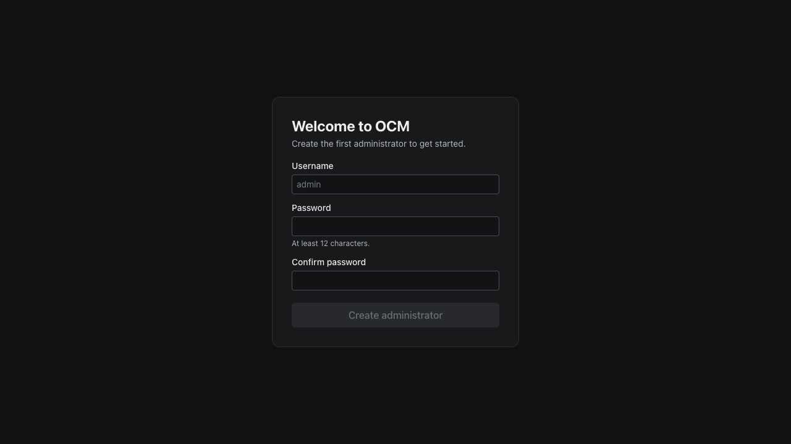
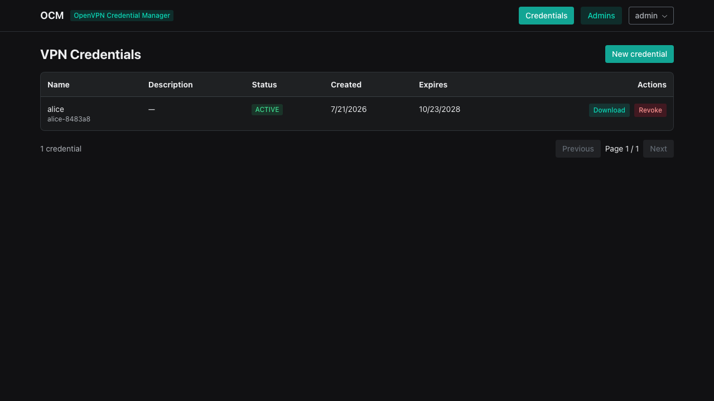
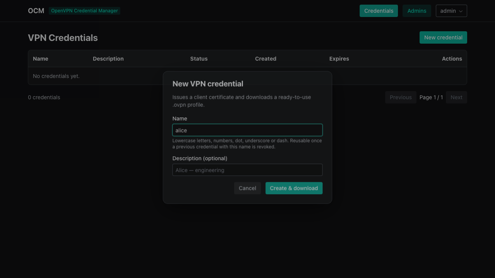
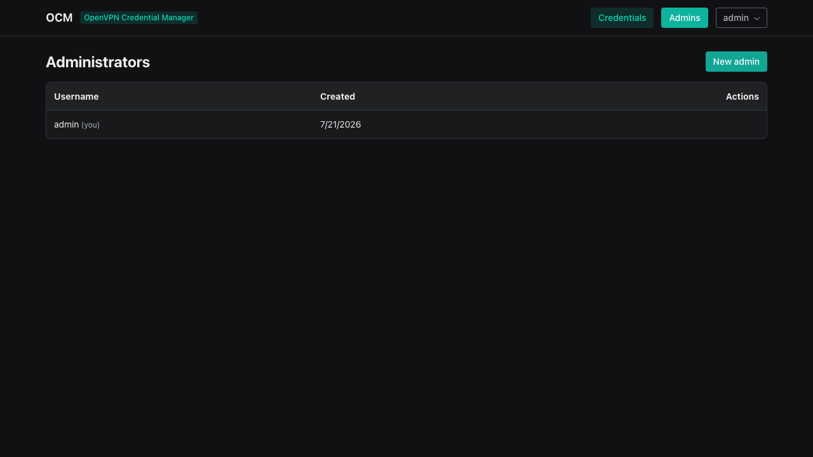
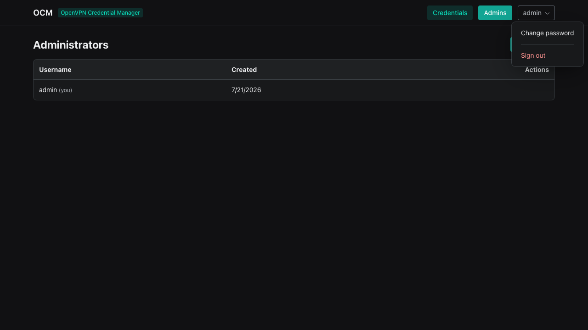
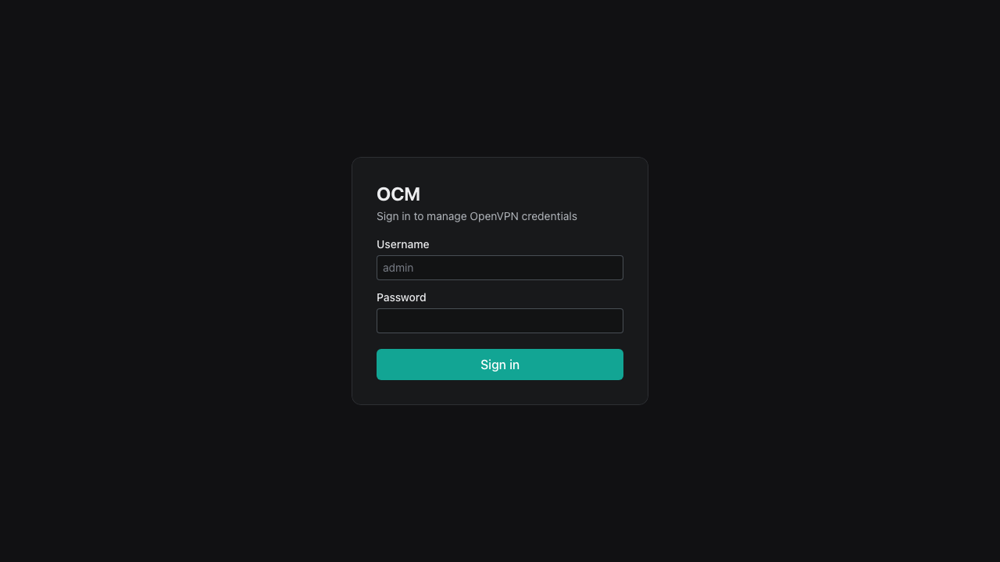

# OCM – OpenVPN Credential Manager

A secure, minimal admin panel to **issue and revoke OpenVPN client credentials**
for an **existing OpenVPN server**. One job, done well. Focus: **security,
simplicity, functionality**.

> **OCM manages your VPN — it never installs one.** It attaches to an OpenVPN
> server that is already running, issues clients from the CA that server already
> uses, and leaves its configuration, routing and firewall untouched. It does
> not create a CA, a server certificate or a VPN instance.

- **API** — NestJS + `better-sqlite3`, admin-only, every route validated by DTOs,
  login brute-force lockout.
- **Web** — React + Vite + `@radix-ui/themes`.
- **CLI** — `ocm-admin` creates/resets admins locally. The system starts with
  **no admin** — create the first one from the browser (first-run setup wizard)
  or the CLI.
- **Installer** — a `.deb` that **attaches to your existing OpenVPN**: it
  verifies the deployment, adopts its easy-rsa PKI and derives a client profile
  template from the running server config. The NestJS service serves both the
  API and the console — no nginx.

---

## Screenshots

| First-run setup                                   | Credentials                                             |
| ------------------------------------------------- | ------------------------------------------------------- |
|  |  |

| Issue a credential                                           | Administrators                                    |
| ------------------------------------------------------------ | ------------------------------------------------- |
|  |  |

| Change password                                             | Sign in                                 |
| ----------------------------------------------------------- | --------------------------------------- |
|  |  |

> Generated by the Playwright end-to-end test — `pnpm test:e2e` drives the whole
> system and captures these along the way.

---

## Architecture

```
┌────────────┐     /api      ┌──────────────┐    execFile     ┌───────────┐
│  React web │ ─────────────▶│  NestJS API  │ ──────────────▶ │  easy-rsa │
│ (radix-ui) │◀───────────── │ better-sqlite│                 │  (PKI)    │
└────────────┘  JWT (Bearer) └──────────────┘                 └───────────┘
   served by the same          systemd: ocm-api         your existing
   NestJS process (no nginx)                            openvpn server

  ocm-admin CLI ─▶ same SQLite file (admins + import existing clients)
```

- The API is the only component that touches the PKI. It shells out to
  `easy-rsa` **only via `execFile` with argument arrays** — never a shell,
  never string interpolation.
- SQLite stores admin accounts and credential metadata. Certificates/keys live
  in the OpenVPN PKI on disk, never in the database.
- The PKI is **adopted, not created**. OCM reads the server config to match its
  control channel (`tls-crypt`/`tls-auth`), cipher and port, so the profiles it
  builds work with the server you already run.

## Project layout

```
apps/
  api/          NestJS API (auth + lockout, admins, vpn)
  web/          React + Vite console
  cli/          ocm-admin — standalone admin CLI (better-sqlite3 only)
installer/
  debian/       control, maintainer scripts, debconf templates
  scripts/      build-deb.sh, setup-openvpn.sh, ocm-admin
  systemd/      ocm-api.service
docker/         Dockerfiles + compose (evaluation)
docs/           architecture & security notes
```

No shared `packages/` — the app is small enough that the API and web each keep
their own local types. Simplicity over layering.

## Get started — install onto your OpenVPN server

Target: the **Ubuntu/Debian host already running OpenVPN** (amd64 or arm64
package to match). SSH in as root.

**Prerequisite:** a working OpenVPN server with an **easy-rsa PKI** — i.e. a
directory holding `ca.crt` and `private/ca.key` (typically
`/etc/openvpn/easy-rsa/pki`). OCM issues clients from that CA; if there is no
PKI, the installer stops and asks you to set OpenVPN up first.

**1. Install Node ≥ 20** (Ubuntu ships 18; the `.deb` depends on the apt
`nodejs` package):

```bash
apt update
curl -fsSL https://deb.nodesource.com/setup_22.x | bash -
apt install -y nodejs easy-rsa
```

**2. Download the `.deb`** from the GitHub Release (matching the arch):

```bash
curl -fLO https://github.com/castroneto/OCM-OpenVPN-Credential-Manager/releases/download/v0.3.0/ocm_0.3.0_amd64.deb
```

**3. Install it.** debconf asks where your OpenVPN lives — the PKI directory,
the config directory, the public host clients connect to, and the console's
port and bind address:

```bash
apt install -y ./ocm_0.3.0_amd64.deb
```

The installer verifies OpenVPN, adopts that PKI, derives a matching client
template into `/etc/ocm/client-template.ovpn`, and starts the console. **No
VPN, CA or server certificate is created, and no routing or firewall rule is
changed.**

**4. Adopt the clients you already issued** (optional) — so the console lists
them and can revoke or re-download their profiles:

```bash
sudo ocm-admin import-clients --dry-run   # preview
sudo ocm-admin import-clients
```

It reads the CA's `index.txt`, skips the server certificate and anything
already known, and only inserts metadata rows — certificates and keys are never
touched.

**5. Create the first administrator** — the console starts with none:

```bash
sudo ocm-admin create admin
```

**6. Open the console.** It binds `127.0.0.1` by default, so reach it through
an SSH tunnel and browse to `http://localhost:8080`:

```bash
ssh -L 8080:127.0.0.1:80 root@<server>
```

Sign in → **Credentials → New credential** → a ready-to-use `.ovpn` downloads
immediately, built for the server you already run.

> ⚠️ **Before binding the console to a public interface:** it serves plain
> **HTTP**. Put a TLS reverse proxy (Caddy/nginx + Let's Encrypt) in front, or
> restrict the port to your IP in the firewall. The default `127.0.0.1` keeps
> it off the network entirely.

### ocm-admin CLI

Runs locally against the OCM database:

```bash
sudo ocm-admin create <username>          # create an admin
sudo ocm-admin reset-password <username>  # rotate a password
sudo ocm-admin list                       # list admins
sudo ocm-admin delete <username>          # remove an admin
sudo ocm-admin import-clients [--dry-run] # adopt clients already in the PKI
```

### Build the .deb yourself

```bash
pnpm install
bash installer/scripts/build-deb.sh 0.3.0
# -> dist/ocm_0.3.0_amd64.deb
```

Requires `dpkg-deb` (from `dpkg-dev`) and `pnpm`. Build on amd64 so the
`better-sqlite3` native binary matches the target.

## Local development

Prerequisites: Node ≥ 20, pnpm 10.

```bash
pnpm install
cp apps/api/.env.example apps/api/.env   # set a 32+ char OCM_JWT_SECRET
pnpm dev                                 # API (:3000) + web (:5173)
```

Create a local admin (schema is created by the API/migrate first):

```bash
pnpm --filter @ocm/api migrate         # ensure the SQLite schema exists
pnpm --filter @ocm/cli admin create admin
```

Credential issuing needs `easy-rsa`/`openvpn` installed locally with
`OCM_PKI_DIR` / `OCM_EASYRSA_BIN` / `OCM_OPENVPN_DIR` pointing at a PKI.

## Docker (evaluation)

```bash
docker compose -f docker/docker-compose.yml up --build
# create the first admin (run as the non-root ocm user, the CLI is bundled):
docker compose -f docker/docker-compose.yml exec -u ocm api node cli/main.js create admin
# web console -> http://localhost:8080
```

Docker is for evaluating the API + console (PKI is auto-provisioned). Real VPN
deployment uses the `.deb` on your existing OpenVPN host.

### End-to-end tests

```bash
pnpm test:e2e
```

Brings up the Docker stack on a fresh volume and drives the whole system with
Playwright — first-run setup, issuing a real `.ovpn`, changing a password,
logout/login — which also regenerates the screenshots above.

## Security highlights

- **Admin only.** One role, guards enforced globally, `@Public()` to opt out.
- **Login lockout.** After `OCM_LOGIN_MAX_ATTEMPTS` (default 5) failures a
  username is locked for `OCM_LOGIN_LOCK_SECONDS` (default 15 min).
- **Everything is a DTO.** Body, params (`:id` → UUID), and query all validated
  with `whitelist + forbidNonWhitelisted + forbidUnknownValues`.
- **No shell.** PKI tools run via `execFile` + argument arrays. No `exec`,
  no `bash -c`, no interpolation.
- **Passwords** hashed with scrypt (`node:crypto`), constant-time verify.
- **Token revocation.** Deleting an admin invalidates their JWT on the next
  request; short token TTL (default 30 min) bounds any residual access.
- **CRL never expires.** The CRL is refreshed on boot and weekly (and issued
  with a long validity), so revocation stays enforced and OpenVPN never locks
  out every client on an expired list.
- **Hardened headers.** `helmet` + a strict Content-Security-Policy applied to
  the console (served by the same process); small request-body limit.
- **Config validated at boot** — refuses to start on a weak/missing secret.

See [docs/SECURITY.md](docs/SECURITY.md) and [docs/ARCHITECTURE.md](docs/ARCHITECTURE.md).

## License

[MIT](LICENSE) © 2026 Castro Neto
